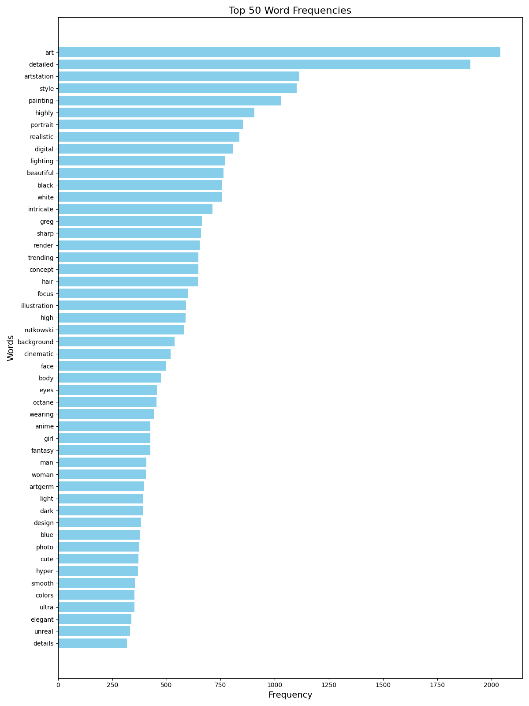
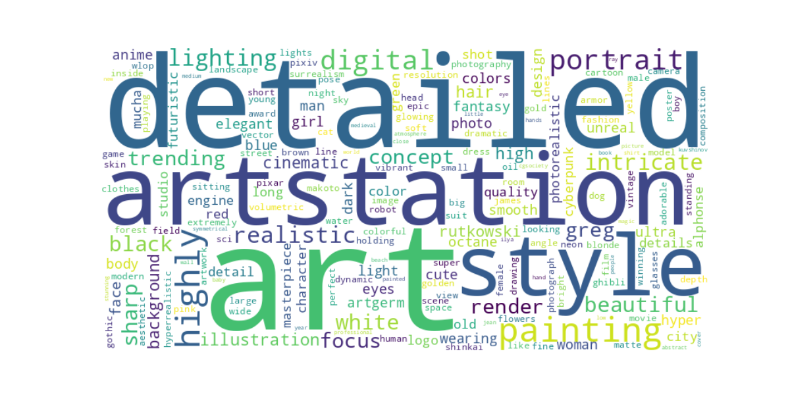

# AI-PromptInsights

This project is a test and practice environment created to explore and analyze AI image generator prompt history using advanced Natural Language Processing (NLP) techniques. The focus is on experimenting with tools like **spaCy** and **BERT** while creating visual representation for the outputs and practical integrations like an API and a discord bots.

## Key Features
- **NLP Analysis**: 
  - Extracts word frequencies, identifying entities, and evaluating contextual features.
  - Explored **spaCy** and **BERT** separately to compare their capabilities and results.
- **Dataset**:
  - Used the **900k Diffusion Prompts Dataset** from [Kaggle](https://www.kaggle.com/datasets/tanreinama/900k-diffusion-prompts-dataset/data).
  - Distributed these prompts among different user IDs to emulate user-specific prompt histories.
- **Visualizations**:
  - Clear and intuitive representations of words used in prompts, including horizontal bar plots and word clouds.
- **Batch Processing**:
  - Optimisation by Using the `datasets` library to process prompts in batches.
  - Converted the list of prompts into a Dataset object for more efficient processing.
- **API Integration**:
  - Accessible endpoints for prompt analysis and visual output generation.
  - Using ngrok to set up a simple Flask API in google colab.
- **Discord Bot**:
  - Simple and user-friendly interface for real-time prompt analysis and visualization within a community platform using the created API

## Project Overview

### Problem Statement
Analyzing the history of prompts used in AI image generation can uncover patterns, trends, and insights. Extracting meaningful information from textual data with advanced NLP tools and techniques. Additionally, making these analyses accessible through visual outputs, APIs, and a discord bot.

## Showcase

Here are some examples of the outputs generated by the project:

### Horizontal Bar Plot visualizing the word frequency 

### Word Cloud visualizing the word frequency in a more creative way

### Discord Bot Usage Examples

#### Retrieving Horizontal Bar Plot

#### Retrieving Word Cloud

## How to Use

(Please note that this project is a personal test project and is not intended to provide detailed easy instructions on how to use the code. Additionally, some features are only explored in the test code and have not been implemented in the API code.)

To use the project, follow these steps:

1. **API Setup**:
   - run the Jupyter Notebook in Google colab

2. **Discord Bot Setup**:
   - Create Discord bot using discord developers applications
   - Clone the repository and navigate to discord-bot
   - Add your bot token and your API url created above inside of main.py
   - Run main.py and now your discord bot is active
    
4. **Analysis**:
   - Use the API or Discord bot commands to:
     - Create and Retrieve a horizontal bar plot for word frequencies from a specific User-ID.
     - Create and Retrieve word cloud for word frequencies from a specific User-ID.
